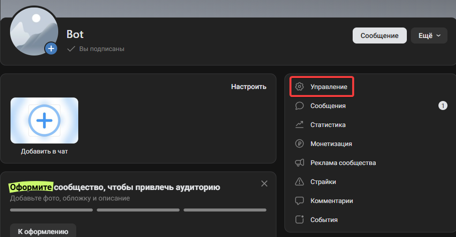
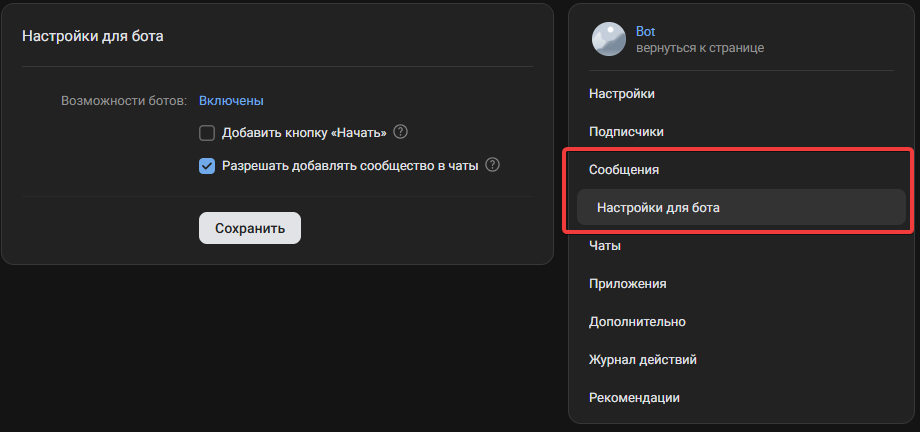
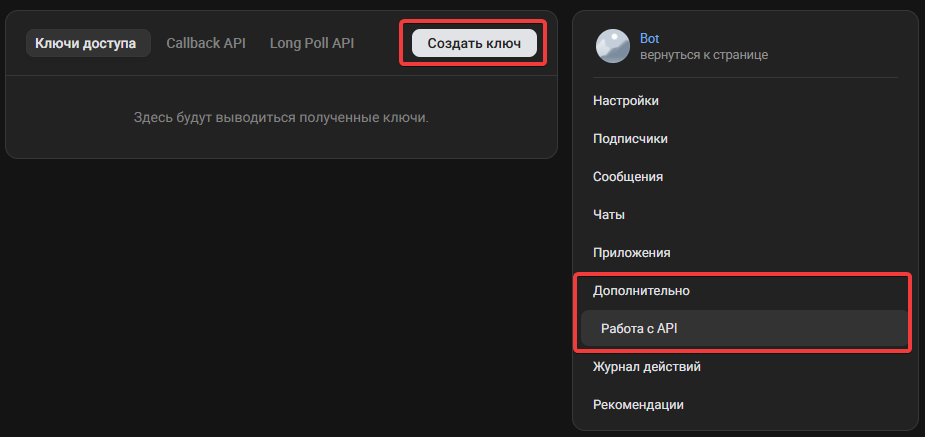
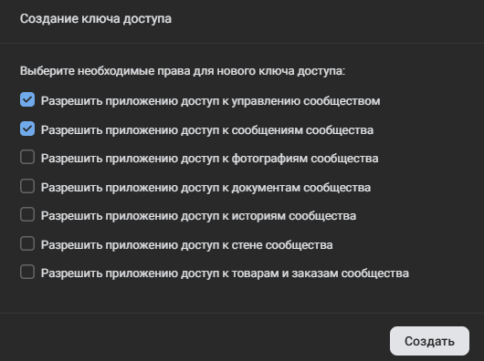
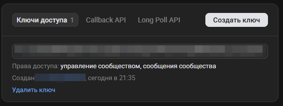
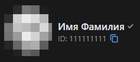
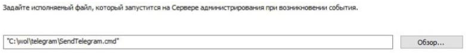

# Система оповещений о событиях безопасности 

Микросервис для приёма событий от Kaspersky Security Center, форматирования их в удобочитаемый вид и отправки уведомлений пользователям через ВК бот.

## Требования

- Python 3.8+
- Установленные зависимости (см. `requirements.txt`)
- ВК‑токен бота

## Установка
Для исходного кода:
```bash
git clone <repo-url>
cd <project-folder>
pip install -r requirements.txt
```
Для исполняемого файла скачать файл из release.

## Конфигурация

```
[VK]
ACCESS_TOKEN = token					# ваш токен VK-бота
API_VERSION = 5.199

[HTTP]
HTTP_HOST = 127.0.0.1
HTTP_PORT = 12345

[USERS]
DEFAULT_USERS = { 						# ID пользователей ВК
	user1_id, 
	user2_id
	}	

[MESSAGES]
MAX_MESSAGE_LENGTH = 4000
```

## Настройка в ВК

Для работы необходимо создать сообщество ВК. Это делается во вкладке «Сообщества». После создания заходим в наше сообщество и жмем на кнопку «Управление»



Далее необходимо перейти в «Сообщения» выбрать «Настройки для бота» и включить возможности ботов.



Затем необходимо создать токен ВК. Для этого перейти в меню «Дополнительно» затем «Работа с API» и выбрать «Создать Ключ»



Ключ необходимо создать с правами:
- Разрешить приложению доступ к управлению сообществом
- Разрешить приложению доступ к сообщениям сообщества



Полученный ключ необходимо вставить в поле 'ACCESS_TOKEN = token' конфигурационного файла.



Для получения сообщений от бота необходимо написать ему хотя бы один раз. 

Получить айди пользователя для добавление в конфиг можно по ссылке https://id.vk.ru/account/#/personal



## Настройка KSC

Выберите нужное событие или политику, затем в качестве способа уведомления укажите «исполняемый файл» и в появившемся поле введите путь к скрипту sendToFlask.cmd.



## Запуск
Для запуска из исходного кода:
```bash
python main.py
```
Для запуска из исполняемого файла необходимо просто запустить файл .exe

Сервер запустится на указанном хосте/порту. Воркер очереди стартует автоматически в отдельном потоке.

## Отправка события
Событие отправляется POST‑запросом на /event с телом в формате application/x-www-form-urlencoded. Поля, которые извлекаются и форматируются:

```
Поле			                Описание
SEVERITY		                уровень события
COMPUTER		                имя компьютера
EVENT			                название события
DESCR			                описание 
RISE_TIME		                время события
KL_PRODUCT		                продукт Kaspersky
KL_VERSION		                версия продукта
KLCSAK_EVENT_TASK_DISPLAY_NAME	имя задачи
HOST_IP			                IP хоста
HOST_CONN_IP	                IP соединения
```

## Структура проекта
```
├── main.py                 # точка входа, запускает Flask + воркер
├── config.py               # проверка и чтение конфигурационного файла
├── config.cfg     			# файл конфигурации
├── requirements.txt        # зависимости
├── web/
│   └── web_server.py       # Flask‑эндпоинты /event и /health
├── parser/
│   ├── sanitizer.py        # удаление хешей из текста
│   └── formatter.py        # форматирование словаря в сообщение
├── worker/
│   └── queue_worker.py     # очередь и цикл отправки в ВК
├── vk/
│   ├── sender.py           # отправка одного сообщения ВК
│   └── users.py            # управление списком получателей
└── sendToFlask.cmd         # скрипт выполняемый KSC при возникновении события
```

## Ограничения

Очередь хранится в памяти — при перезапуске сервера неотправленные сообщения теряются.

Воркер один, задачи обрабатываются последовательно.

Токен VK должен быть действительным; ошибки отправки игнорируются.
